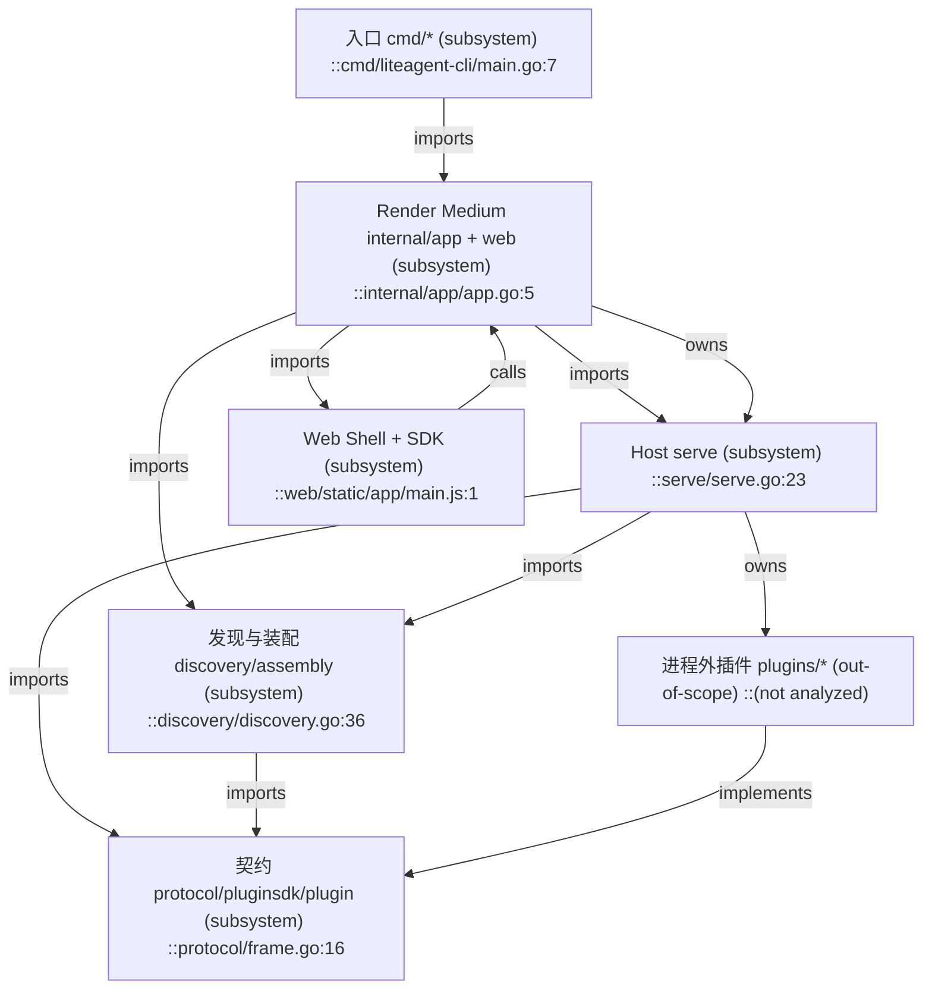
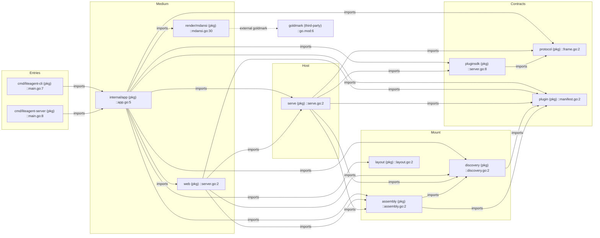
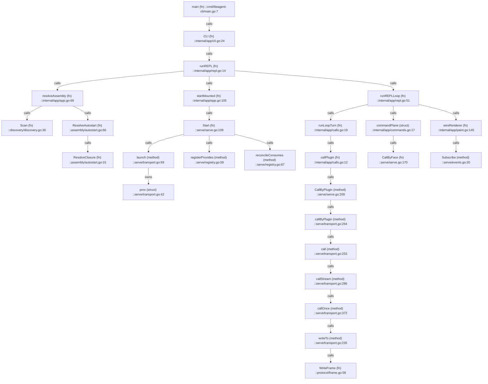
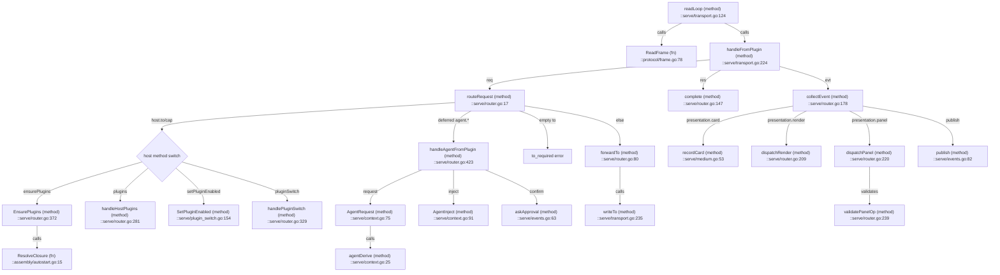
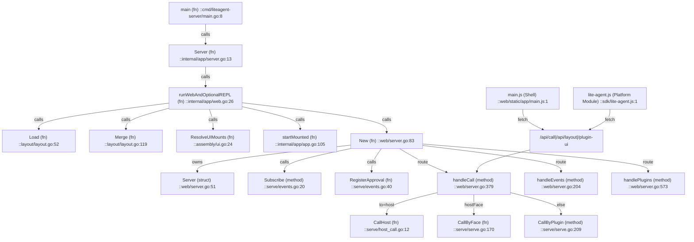

# my-go-lite-agent 依赖图 — DEPENDENCY

> 范围：**除 `plugins/`**。层级：**L1 模块默认**；另附核心 L2 调用链。  
> 边 kind：`imports`（Go import）· `calls`（运行时调用）· `owns`（组合/生命周期）· `implements`（接口实现）· `unverified`。  
> 节点格式：`名称 (kind) ::path:line`。完整符号见 [INDEX.md](INDEX.md)；讲解见 [OVERVIEW.md](OVERVIEW.md)。

---

## 图 A — L0 子系统总览

---

## 图 B — L1 模块 imports（Go 包级）

证据来自各源文件 import 块（已抽样打开）。

**核实过的 import 证据（抽样）**：

| from | to | 证据 |
|------|----|------|
| `cmd/liteagent-cli` | `internal/app` | `cmd/liteagent-cli/main.go:5` |
| `cmd/liteagent-server` | `internal/app` | `cmd/liteagent-server/main.go:6` |
| `internal/app` | `serve`,`discovery`,`assembly`,`protocol` | `internal/app/app.go:14-17` |
| `internal/app` | `web`,`layout`,`assembly` | `internal/app/web.go:11-13` |
| `internal/app` | `pluginsdk`,`render/mdansi`,`serve` | `internal/app/paint.go:8-10` |
| `web` | `serve`,`assembly`,`discovery`,`plugin` | `web/server.go:18-21` |
| `serve` | `protocol`,`discovery` | `serve/serve.go:12-13` |
| `serve` | `assembly`,`plugin`,`pluginsdk`,`protocol` | `serve/router.go:10-14` |
| `pluginsdk` | `protocol` | `pluginsdk/server.go:17` |
| `discovery` | `plugin` | `discovery/discovery.go:10` |
| `assembly` | `discovery` / `plugin` | `assembly/autostart.go:8` / `ui.go:9` |

---

## 图 C — 核心运行时调用链（L2/L3，REPL 金路径）

---

## 图 D — Host 入站 Frame 路由（L2）

**说明**：`CBD` 仅用于 deferred `agent.request`；`callByCapOwner`（`serve/context.go:13`）在这条特例路径上按 `provides` 查属主。主路由 **不** 按 capability 分支。

---

## 图 E — Web Medium（L2）

---

## 边抽查清单（≥5，均已打开源文件）

| # | 边 | 证据 | 结论 |
|---|----|------|------|
| 1 | `internal/app` calls `serve.Start` | `app.go:109` `serve.Start(mounted)` | ok |
| 2 | `resolveAssembly` calls `discovery.Scan` + `assembly.ResolveAutostart` | `app.go:73,77` | ok |
| 3 | `runLoopTurn` → `CallByPlugin("agent","loop","turn")` | `callx.go:24` via `callx.go:12-14` | ok（L0 点名） |
| 4 | Host `routeRequest` 对空 `to` 返回 `to_required` | `router.go:58-66` | ok（不按 cap 路由） |
| 5 | `EnsurePlugins` 调用 `assembly.ResolveClosure` | `router.go:376` | ok |
| 6 | `web.handleCall` 三分支 host / face / plugin | `server.go:435-441` | ok |
| 7 | `pluginsdk` → `protocol` | `server.go:17` | ok |
| 8 | Shell 仅映射五区 | `main.js:19-25` + `plugin.UISlots` `manifest.go:64` | ok（ADR-0031） |

---

## 不入图 / unverified

| 项 | 处理 |
|----|------|
| `plugins/**` 内部符号 | 范围排除，仅图 A 以 out-of-scope 节点示意 |
| `internal/app` 各测试文件 | 不入运行时图 |
| `assembly.Resolve` 白名单路径 | 仍存在（`assembly.go:71`），**无日常调用方**；`-assembly` 在 `resolveAssembly` 被忽略，故不画入金路径 |
| JS 模块细粒度 call 图 | 仅画 Shell → HTTP 面；loader/events/plugins-panel 内部未展开 |
| 第三方 goldmark 实现细节 | 外部依赖，仅 dotted 边 |
