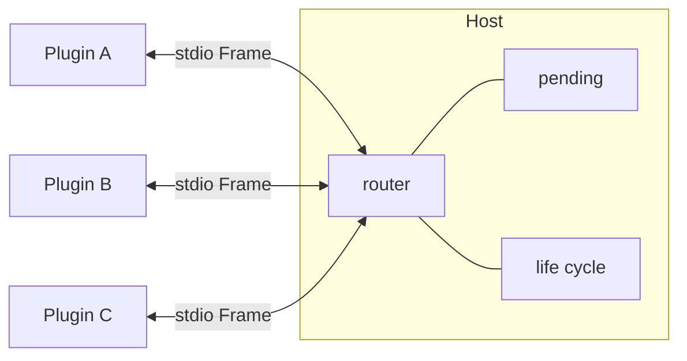

# Protocol 开发文档

Host ↔ Plugin 进程间通信的实现说明。规范名词见 [CONTEXT.md](../CONTEXT.md)；架构决策见 [docs/adr/](adr/)。

本文描述**当前代码已落地**的行为。Frame 线协议与 Manifest 契约均已升至 **5**（ADR-0030 点名路由已落地于 `protocol` / `pluginsdk` / `serve`）；Host 侧仍有少量 Deferred 与 Medium 残留 L1——见文末[演进方向](#9-演进方向与adr-0030)。分模块开发文档见 [docs/modules/](modules/)。

---

## 1. 两层版本（勿混谈）

| 层 | 常量 | 位置 | 作用 |
|----|------|------|------|
| **Frame 线协议** | `protocol.Version = 5` | `protocol/frame.go` | 消息怎么编码、字段语义 |
| **Manifest 契约** | `plugin.CurrentProtocol = 6` | `plugin/manifest.go` | `plugin.json` 可声明什么（UI、hostFaces…） |

对应关系：

- Frame 的 `V` 字段只版本化线协议。v1→v2：Presentation render kinds 变为 `markdown_text \| message_text \| summary_text`。v5：引入 `To`，Host 按插件名寻址 + 不透明 payload。
- Manifest 的 `protocol` 字段是**另一条线**。Host 校验范围为 `1..CurrentProtocol`；更高版本拒载。协议 4 引入 `hostFaces`（ADR-0027）；协议 5 对齐 L0-only / 点名路由；协议 6 对齐 Shell 五区域槽位 top|bottom|left|center|right（ADR-0031）。破坏性 UI 契约变更见 ADR-0012 / ADR-0031。

相关测试：`protocol/frame_test.go`（roundtrip、EOF、零长度拒绝）。

---

## 2. 线格式

### 2.1 编码

```
┌──────────────┬─────────────────────┐
│ uint32 BE    │ JSON body           │
│ length (4B)  │ length bytes        │
└──────────────┴─────────────────────┘
```

- 编解码：`protocol.WriteFrame` / `protocol.ReadFrame`
- 上限：`maxFrameSize = 16 << 20`（16MB），写入前与读取后都校验
- 长度 0 非法，读侧直接报错
- 载体：插件进程的 **stdin / stdout**。stderr 不走协议，直接接到 Host stderr

### 2.2 Frame 字段

```go
type Frame struct {
	V       int             `json:"v"`
	ID      string          `json:"id"`
	Type    string          `json:"type"` // req | res | evt
	To      string          `json:"to,omitempty"`
	Cap     string          `json:"cap,omitempty"`
	Method  string          `json:"method,omitempty"`
	Payload json.RawMessage `json:"payload,omitempty"`
	Error   *FrameError     `json:"error,omitempty"`
}
```

| 字段 | 说明 |
|------|------|
| `V` | Frame 协议版本，当前写 `protocol.Version`（5） |
| `ID` | 请求/响应对齐键；广播 `evt` 可为空 |
| `Type` | `req` \| `res` \| `evt` |
| `To` | **目标插件名**（ADR-0030 寻址键）；Host 原样转发，不解析 payload |
| `Cap` | 接收方插件内的 dispatch 能力名；hostFaces 调用时填面名（`config`/`commands`/`ui`） |
| `Method` | 能力下的方法名（如 `complete`、`call`、`render`） |
| `Payload` | 不透明 JSON；Host 路由层一般不解读（ADR-0026/0030） |
| `Error` | 仅 `res` 携带；结构化错误见下 |

```go
type FrameError struct {
	Code    string `json:"code"`
	Message string `json:"message"`
}
```

常见 `code`（非穷尽）：

| Code | 含义 | 主要来源 |
|------|------|----------|
| `plugin_down` | 目标插件进程已退出 | Host `markUnhealthy` / 转发回写 |
| `timeout` | 调用超时 | Host 主调 / star 转发 |
| `capability_unavailable` | `cap` 无 owner，或 owner 是自己 | `routeRequest` |
| `route_failed` | 挂载/写帧失败 | `routeRequest` |
| `unknown_tool` | tools.call 名未知 | `routeToolsFromPlugin` |
| `method_not_found` | 插件未注册 `cap.method` | `pluginsdk.dispatch` |
| `handler_error` | Handler 返回普通 error | `pluginsdk.dispatch` |
| `host_closed` | Host 正在关闭 | `routeRequest` |
| `bad_payload` | Host 横切面解析失败 | Host 方法 handler |

---

## 3. 消息类型与生命周期

### 3.1 三种 Type

| Type | 方向 | 语义 |
|------|------|------|
| `req` | 双向 | 期望对端回 `res`；必须有 `ID` |
| `res` | 双向 | 完成某次 `req`；`ID` 对齐；成功填 `payload`，失败填 `error` |
| `evt` | 双向 | 单向事件；可广播（无 `ID`）或归属到 in-flight 调用（有 `ID`） |

未知 `type`：`pluginsdk.Serve` 直接忽略（向前兼容）；Host `handleFromPlugin` 只分发上述三种。

### 3.2 一次典型 Call

```
Host                         Plugin
  │  req  id=host-1             │
  │  cap=llm method=complete    │
  │  payload={...}              │
  ├────────────────────────────►│
  │                             │  Handle("llm","complete",...)
  │  evt  id=host-1             │
  │  presentation.stream        │  EmitStreamTo(host-1, ...)
  │◄────────────────────────────┤  （可选，多次）
  │  res  id=host-1             │
  │  payload={result}           │
  │◄────────────────────────────┤
```

### 3.3 evt 归属

- **无 `ID`**：广播。Presentation card/render/panel/stream/status 通常如此。
- **有 `ID`**：Host `collectEvent` 把帧挂到 `pending[id]`，并在最终 `res` 时一并交给调用方（`CallResult.Events`）；若注册了 `onEvent` 回调则在读循环 goroutine 上即时回调（回调须快且非阻塞）。

---

## 4. 拓扑与进程模型

### 4.1 星型（ADR-0001）

插件是独立进程；**插件之间不直连**。跨插件调用与横切面只经 Host 路由。



代价：每次跨插件调用多一跳本机 IPC；相对模型延迟可接受。

### 4.2 启动与生命周期（`serve/transport.go`）

1. Discovery 得到 `discovery.Found`（含 Manifest、目录）
2. `launch`：`exec.Command(entry)`，接 stdin/stdout pipe；stderr 透传
3. Windows：Job Object 绑定，Host 退出则杀子进程树
4. 为每个插件启动 `readLoop` goroutine
5. Manifest `timeoutMs` 可覆盖默认调用超时（`DefaultCallTimeout = 30s`）
6. `Close`：关全部 stdin → grace `DefaultShutdownGrace = 2s` → kill tree → 关 Job Object

**软失败**（ADR-0017）：单个插件启动失败只打 stderr 警告，不拖垮 Host。

### 4.3 崩溃恢复

| 步骤 | 行为 |
|------|------|
| readLoop 读失败 | `markUnhealthy`：标记 unhealthy；pending 中指向该插件的等待全部以 `plugin_down` 结束 |
| 消费方 | `reconcileConsumes` 重算 provides / degraded（ADR-0022） |
| 下次调用 | `ensureAlive` 重启进程（kill 旧树 → `launch` → 异步 reconcile + discoverTools） |
| Host 主调 | `callStreamOn` 对 `plugin_down` 最多重试一次（重启后再调） |

---

## 5. ID 约定与 pending 表

Host 维护 `pending map[string]*wait`，按 `ID` 做 correlator。

| 前缀 | 生成方 | 用途 |
|------|--------|------|
| `host-N` | Host `callOnce` | Host 主动调某插件 |
| `fwd-N` | Host `routeRequest` | 插件发起的 star 转发；Host 换 ID 防撞 |
| `sdk-N` | `pluginsdk.Call` | 插件反向经 Host 调其他能力 |

转发时保存 `origID`；owner 的 `res` 到达后，Host 把 `ID` 改回 `origID` 再回给 caller（`serve/router.go` 的 `complete`）。

`wait` 两种 kind：

- `waitHost`：结果投递到 Go channel（Host 内 API）
- `waitPlugin`：结果改 ID 后写回调用方插件的 stdin

---

## 6. Host 侧路由

### 6.1 入口分发

`handleFromPlugin`（`serve/transport.go`）：

| Type | 处理 |
|------|------|
| `req` | `routeRequest` |
| `res` | `complete` |
| `evt` | `collectEvent` |

### 6.2 `routeRequest` 分支顺序（当前实现）

1. Host 已关闭 → 回 `host_closed`
2. **Host 横切面**（`To` 或 `Cap` = `host`）：`ensurePlugins` | `plugins` | `setPluginEnabled` | `pluginSwitch`（ADR-0023/0032）；无 agent 域特例（ADR-0034 清零 Deferred）
3. **空 `to`** → 拒绝 `to_required`（ADR-0030：L0 之后不再有星型路由）
4. **`to == from`** → `route_failed`（cannot call self by name）
5. **按名转发** `forwardTo(to)`：换 `fwd-N` 写目标插件 stdin；超时定时器到点 → 回 `timeout` 并删 pending

### 6.3 Host 对外调用入口（`serve/serve.go`）

| API | 寻址 | 说明 |
|-----|------|------|
| `CallByPlugin(name, cap, method, payload)` | 插件名 | L0 点名调用（ADR-0030）；`cap`/`method` 是**接收方**的分发键，Host 不按 cap 路由 |
| `CallByFace(s, name, face, method, payload)` | 插件名 + face | 校验 Manifest 已声明 `hostFaces`（config\|commands\|ui）后才转发（ADR-0027） |
| 内部 `call` / `callByPlugin` / `callStream` | — | 不导出给 Medium；导出面已按 ADR-0027 收窄 |

内部 `callOnce` 流程：分配 `host-N` → 注册 pending → `writeTo` → select channel / timeout。

### 6.4 Presentation 与事件

`collectEvent` 对 Presentation 做 Host 级观测/校验（不改业务 payload 语义）：

| method | Host 行为 |
|--------|-----------|
| `card` | 记录卡片（可无 id） |
| `render` | 解码为 `pluginsdk.RenderIntent`，publish `presentation` |
| `panel` | `validatePanelOp` 后 publish `panel`；违规则 `status` warn 并丢弃 |
| `stream` | 原样 publish `stream`（Host 不解读字段，ADR-0026） |
| `status` | 原样 publish |

PanelOp 校验（保留自 ADR-0010）：`op ∈ set|clear`、slot 合法、`set` 时 component 必须是合法 custom element 且以 `<plugin>-` 为前缀、props 必须是 JSON object。

**通用 evt 中继（ADR-0034）**：`cap` 非 `presentation` 且**无 id** 的 evt，按 `Topic:"evt"` 原样透传 `{cap, method, payload}` 给所有 Medium——Host 不解释内容（session choice 问答即走此通道）。带 id 的 evt 归属到 pending call（`wait.events` / `onEvent`），不广播。

---

## 7. 插件侧：`pluginsdk`

作者 API。**不要手写 Frame 循环。** 包注释：破坏性变更需 bump protocol 字段。

### 7.1 核心

```go
srv := pluginsdk.New()

srv.Handle("tools", "call", func(req *pluginsdk.Request) (json.RawMessage, error) {
	// req.ID / Cap / Method / Payload
	return resultJSON, nil // 或 &protocol.FrameError{Code: "...", Message: "..."}
})

payload, err := srv.Call("session", "append", body) // 阻塞至 res
_ = srv.Emit("presentation", "card", cardJSON)      // 广播
_ = srv.EmitTo(reqID, "presentation", "stream", p)  // 归属到调用

err = srv.Serve() // 阻塞到 stdin 关闭；EOF 时 failPending
```

实现要点（`pluginsdk/server.go`）：

- `Handle` 键为 `cap+"."+method`，后注册覆盖
- `Serve`：`req` 开 goroutine `dispatch`；`res` 完成 `pending[id]` 的 channel
- 写 stdout 全程加锁，支持并发 `Call`/`Handle`/`Emit`
- Handler 错误：`*FrameError` 原样带回，否则包装为 `handler_error`
- 未注册 method → `method_not_found`

### 7.2 公开 Capability 名（契约，非插件目录名）

定义在 `pluginsdk/presentation.go`，Host 与插件共享：

```text
session · agent · llm · system-prompt · context · loop · tools · echo(probe)
```

### 7.3 Presentation 契约

| 常量 | cap | method | 语义 |
|------|-----|--------|------|
| `PresentationMethod` | `presentation` | `card` | Presentation Card |
| `PresentationRender` | `presentation` | `render` | 分类主窗内容 |
| `PresentationPanel` | `presentation` | `panel` | Web PanelOp |
| `PresentationStreamEvt` | `presentation` | `stream` | 瞬态流（start\|chunk\|end） |
| `PresentationStatusEvt` | `presentation` | `status` | 状态信号 |

RenderKind（Frame v2）：`markdown_text` | `message_text` | `summary_text`。

`RenderIntent` 含 `sessionId`（空表示默认会话，不要 omitempty 掉）。

常用封装：`EmitCard` / `EmitRender` / `EmitMarkdownText` / `EmitMessageText` / `EmitSummaryText` / `EmitStream` / `EmitStreamTo` / `EmitPanel` / `EmitStatus`。

StreamPayload：`op`（start|chunk|end）、`delta`、`channel`（content|reasoning）、`sessionId`。

### 7.4 最小插件示例

```go
package main

import (
	"os"
	"time"

	"github.com/tomori/my-go-lite-agent/protocol"
)

func main() {
	for {
		f, err := protocol.ReadFrame(os.Stdin)
		if err != nil {
			return
		}
		if f.Type != protocol.TypeReq {
			continue
		}
		time.Sleep(time.Millisecond)
		_ = protocol.WriteFrame(os.Stdout, &protocol.Frame{
			V: f.V, ID: f.ID, Type: protocol.TypeRes,
			Cap: f.Cap, Method: f.Method, Payload: f.Payload,
		})
	}
}
```

生产代码请改用 `pluginsdk`。

---

## 8. Manifest 与协议字段

`plugin.json`（`plugin/manifest.go`）与 Frame 线协议独立：

```json
{
  "name": "session",
  "version": "1.0.0",
  "protocol": 4,
  "entry": "session",
  "timeoutMs": 30000,
  "provides": ["session"],
  "consumes": ["llm", "tools"],
  "dependsOn": ["llm-openai"],
  "autostart": true,
  "hostFaces": ["config", "commands"],
  "commands": [{ "name": "help", "description": "...", "usage": "..." }],
  "ui": { "entry": "entry.js", "mounts": [] }
}
```

校验要点：

- `name` 匹配 `^[a-z0-9-]+$`
- `protocol` ∈ `1..CurrentProtocol`（当前 6）
- `entry` 或 `ui` 至少其一；无 entry 的 UI-only 插件不得 `provides`
- `hostFaces` 仅 `config` | `commands` | `ui`，不可重复
- `dependsOn` 按插件名；不可自引用
- UI entry 必须在 `ui/` 下的 `.js`；mount component 必须以插件名前缀

`provides` / `consumes`：声明与观测（degraded、Plugin Graph）。非 `tools` 能力唯一属主冲突时 `registerProvides` 报错（可见、不致命）。

---

## 9. 演进方向与 ADR-0030

Frame/Manifest 线与 Host 路由已按 ADR-0030 收紧。下表区分「已落地」与「残留」：

| 项 | 状态 |
|----|------|
| Host 寻址插件名（`To` + 不透明 payload） | **已落地**（`protocol.Version = 5`） |
| Host 不按业务 `cap` 分支；`CallByPlugin` / `CallByFace` | **已落地** |
| tools 多提供方合并不在 Host | **已落地**（loop/agent 自 fan-out） |
| `CurrentProtocol = 6` | **已落地** |
| `agent.request/inject/confirm` | **Deferred**（Host 暂留特例，勿扩大） |
| Medium 残留 L1（`session.create` workspace 种子、`runLoopTurn` 点名等） | 收敛中，见 [internal/app](modules/internal-app.md) / [web](modules/web.md) |

阅读顺序建议：本文 → [docs/modules/](modules/) → ADR-0001 → ADR-0026 → ADR-0027 → ADR-0030。

---

## 10. 源码地图

| 路径 | 职责 |
|------|------|
| `protocol/frame.go` | Frame 类型、编解码、`Version` |
| `protocol/frame_test.go` | 线格式单测 |
| `pluginsdk/server.go` | 插件运行时：Handle/Call/Emit/Serve |
| `pluginsdk/presentation.go` | Presentation 契约与 Capability 名 |
| `plugin/manifest.go` | Manifest、`CurrentProtocol`、UI/hostFaces 校验 |
| `serve/serve.go` | Host 入口、`Start`、`CallByPlugin`、`CallByFace`、默认超时 |
| `serve/transport.go` | 进程 launch/readLoop/写帧/callOnce/Close |
| `serve/router.go` | 按 `to` 转发、evt 收集、ensurePlugins、Deferred agent.* |
| `serve/registry.go` | provides / faces / degraded 观测 |
| `serve/medium.go` | Render Medium 事件主题等 |
| `discovery/` | 插件目录扫描 |
| `assembly/` | Autostart + dependsOn 闭包 |

相关 ADR：

| ADR | 主题 |
|-----|------|
| 0001 | 进程外插件 + 星型经 Host |
| 0012 | Web UI 契约 v2、protocol 3 |
| 0017 | 装配与运行时软失败 |
| 0018 | tools 多提供方 |
| 0022 | consumes 软跳过 / degraded |
| 0023 | host.ensurePlugins |
| 0026 | Host↔Plugin 边界判据 |
| 0027 | hostFaces、protocol 4 |
| 0030 | L0-only、点名路由（已落地于 Frame v5） |

---

## 11. 开发约定

1. 插件只通过 `pluginsdk` 说话；不要直接拼 Frame 循环（fixture 除外）。
2. Host 不解读插件 payload 字段语义；构造 L1/hostFace **请求体**属于消费公开契约，允许。
3. Host 生产源不出现插件**目录名**字面量；Capability 名是公开契约，可作常量，但不得 `switch cap` 进业务编排（0030 终态更严）。
4. 破坏 Frame 线格式 → bump `protocol.Version`；破坏 Manifest/UI 契约 → bump `plugin.CurrentProtocol` 并升级出厂插件。
5. 调试：Host `-debug` 会打 `->` / `<-` 帧日志（见 `serve/debug.go`）。
