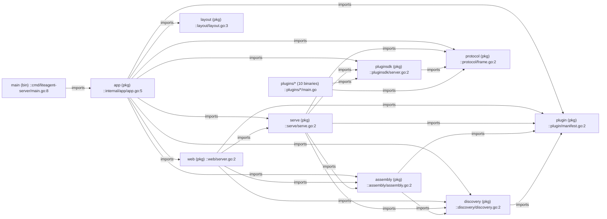
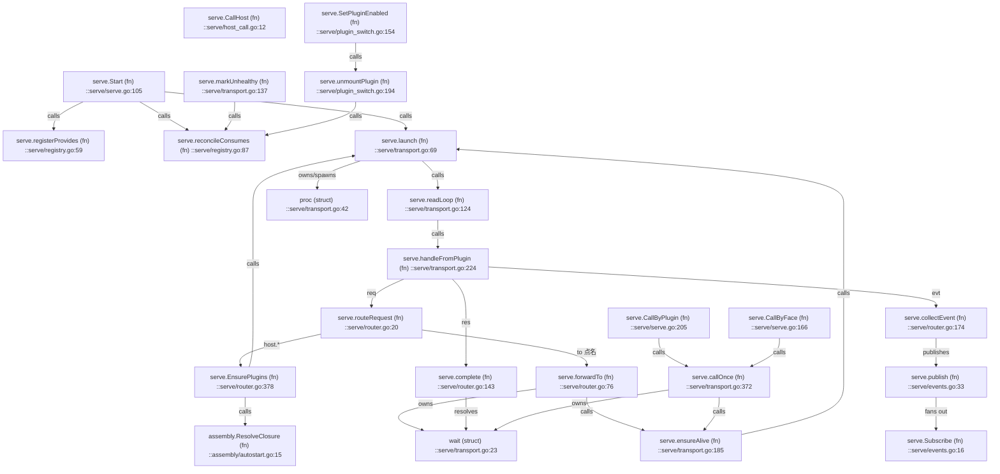
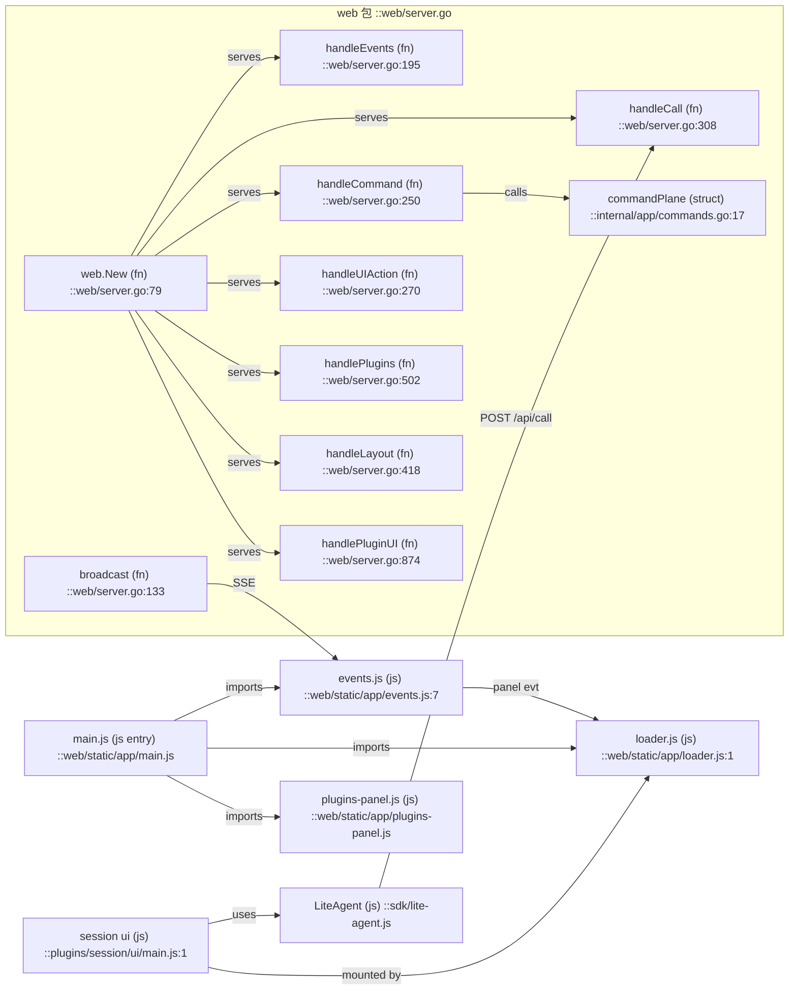
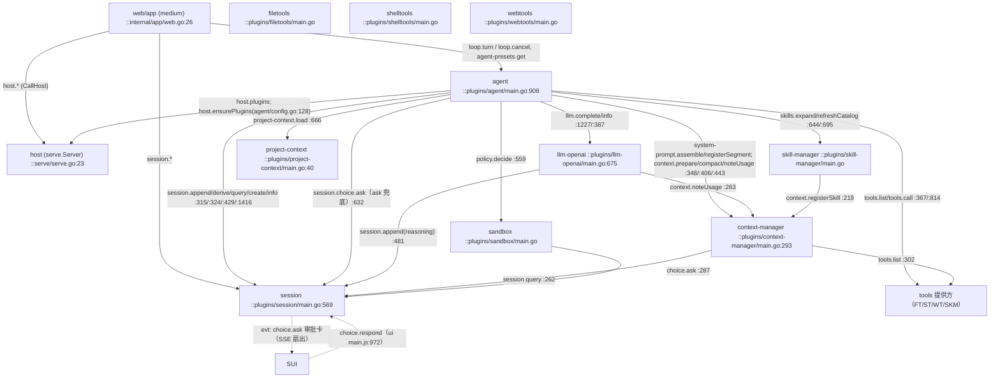
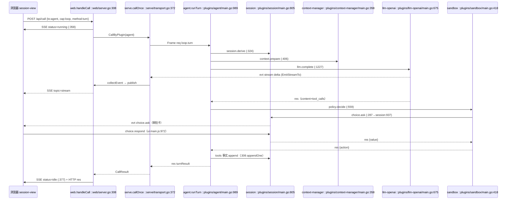

# Project Map — DEPENDENCY（server + plugins）

> 节点格式：`名称 (kind) ::path:line`；边标注类型。符号全表见 [INDEX.md](INDEX.md)。
> 所有边均由 import 块或调用点逐一核实；未经核实的边标 `unverified`。
> 范围：liteagent-server 宿主侧 + plugins/（10 个插件）；CLI Medium（liteagent-cli）已删除。

## 图例

| 边 | 含义 |
|---|---|
| imports | Go 包 import |
| spawns | fork 插件子进程（stdio Frame） |
| calls | 函数调用（含经 Frame 的运行时调用，注明 method） |
| publishes | evt 扇出（SSE / 事件总线） |
| serves | HTTP 路由到处理函数 |

---

## 图 1 — L0：Go 包依赖（imports）

要点：`protocol`、`plugin` 是零依赖叶子（契约层）；宿主（serve/web）与插件（pluginsdk）只共享
契约层，业务包互不 import —— 进程边界在编译期就成立。

---

## 图 2 — L1：serve 包内部（宿主内核）

---

## 图 3 — L1：Web Medium 与浏览器 Shell

---

## 图 4 — L1/L2：运行时插件调用图（Frame 边，经 serve 转发）

节点为插件进程；边为 `CallTo(plugin, cap, method)`，每条边标注了代表性调用点。
宿主（serve）与 Web（app）以特殊节点并入。

注：`tools` 能力是多属主（filetools/shelltools/webtools/skill-manager 都 provides tools），
由 agent 在本地记录 tool→owner 映射后点名调用（agent:286-304）；Host 不合并 tools。

---

## 图 5 — L3：一条 Agent Turn（时序）

