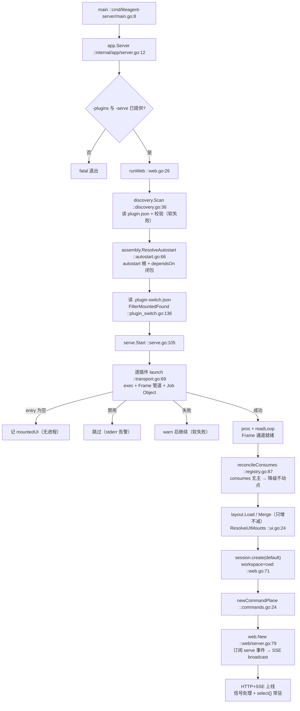
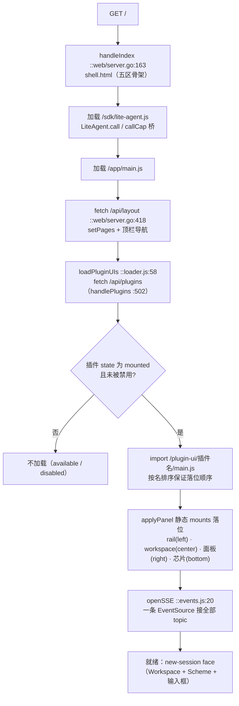
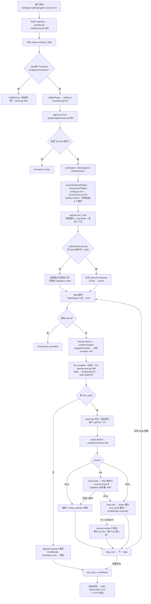

# Project Map — RUNTIME：从启动到 agent 运行的全过程

> 本文是 [OVERVIEW.md](OVERVIEW.md) 的补充：按时间顺序走一遍 liteagent-server 从进程启动到
> 一条 Agent Turn 跑完的完整路径，并配 4 张流程图（启动 / 浏览器接入 / Turn 决策流 / 异常恢复）。
> 所有步骤都对应真实符号（path:line），抽查方式见各阶段末尾。
> 配套：[DEPENDENCY.md](DEPENDENCY.md) 图 5（时序图）· [INDEX.md](INDEX.md)。

## 总览时间线

```
[阶段0] 进程与 flag          main → app.Server
[阶段1] 发现与装配           discovery.Scan → assembly.ResolveAutostart
[阶段2] 拉起插件进程         serve.Start → launch × N → registerProvides → reconcileConsumes
[阶段3] 布局与 UI mounts     layout.Load/Merge → assembly.ResolveUIMounts
[阶段4] 首会话与 Web 上线    session.create(default) → newCommandPlane → web.New → HTTP+SSE
[阶段5] 浏览器接入           shell.html → main.js → /api/layout → /api/plugins → import 插件 UI → openSSE
[阶段6] 第一条消息           /api/call loop.turn → agent.runTurn（Step 循环）→ 渲染回浏览器
```

## 流程图 1 — 宿主启动（贯穿阶段 0–4）



---

## 阶段 0 — 进程与 flag

1. `main`（cmd/liteagent-server/main.go:8）只做一件事：`app.Server()`。
2. `Server`（internal/app/server.go:12）：
   - 定义 flag：`-plugins`（发现根，必需）、`-serve`（监听地址，必需）、`-layout`（缺省 `layout.json`，
     即 cwd 下）、`-debug`（Frame 调试日志 → `serve.SetDebug(true)`，stderr）、
     `-assembly`（已弃用，仅告警）、`-dump`（打印挂载计划）。
   - → `runWeb(...)`（internal/app/web.go:26）。

## 阶段 1 — 发现与装配：决定"谁被挂载"

3. `resolveAssembly`（internal/app/app.go:29）→ `discovery.Scan(pluginsDir)`（discovery/discovery.go:36）：
   读一层子目录的 `plugin.json`；`plugin.LoadManifest`（plugin/manifest.go:151）+ `Validate`（:169）
   校验名称格式、protocol 1..6、entry/ui 二选一、hostFaces ⊆ {config,commands,ui}、
   dependsOn 不自指、UI 组件 tag 必须带 `<插件名>-` 前缀；再检查 entry 与 UI 资源文件存在。
   扫描错误只打印不中止（软失败，ADR-0017）。
4. `assembly.ResolveAutostart`（assembly/autostart.go:66）→ `ResolveClosure`（:15）：
   根 = 声明 `autostart:true` 的插件 + UI-only 插件（entry=="" 且有 ui）；随后沿 `dependsOn`
   前序展开闭包；未知名进 `Plan.Missing`，与保留命令撞名的进 `Plan.Rejected`。
   **按仓库清单，产出挂载集恰好是 4 个进程**：`agent`（dependsOn: session/llm-openai/context-manager）、
   `session`、`context-manager`、`llm-openai`。
   工具类（filetools/shelltools/webtools/skill-manager）、sandbox、project-context **启动时不挂载**——
   它们要么被 scheme 的 `dependsPlugins` 拉起（见阶段 6），要么保持 available。
5. 默认 scheme 是 `tool_calling`（plugins/agent/config.go:57 `defaultConfig`），
   该 scheme **没有 dependsPlugins**（config.go:42）——除非用户切到 `chat`/`coding` 或改
   `config.json`，否则运行期也不会补挂工具插件（后果见阶段 6 步骤 22-24）。

## 阶段 2 — 拉起插件进程（serve.Start）

6. `startMounted`（internal/app/app.go:51）：再 `discovery.Scan` 一次得到新 catalog（供
   ensurePlugins 用）；读 `.plugin-switch.json`（serve/plugin_switch.go:32）得禁用名单；
   `FilterMountedFound`（plugin_switch.go:136）把被禁插件从挂载列表剔除。
7. `serve.Start(mounted)`（serve/serve.go:105）：
   - `newJob()`（serve/job_windows.go）：建 Windows Job Object（KILL_ON_JOB_CLOSE），
     失败仅告警降级为显式 killTree。
   - `registerProvides`（serve/registry.go:59）：登记 能力→插件。非 tools 能力重复属主 → 告警继续；
     `tools` 特许多属主（路由不查这张表，仅供观测/降级）。
   - 逐插件 `launch`（serve/transport.go:69）：`ResolveEntry` → `exec.Command` → stdin/stdout 管道
     （stderr 直通宿主 stderr）→ `job.assign` 绑定父子生命周期 → 超时取 manifest `timeoutMs`
     否则 `DefaultCallTimeout` 30s → 代际号 `gen++` 替换 `proc`（serve/transport.go:42）→
     `go readLoop(name, gen, stdout)`（:124）。UI-only 插件无进程，只记 `mountedUI`（serve.go:132）。
   - `reconcileConsumes`（serve/registry.go:87）：从健康进程重建 provides，然后迭代到不动点——
     任一健康插件的 consumes 无主 → 标记 degraded 并**撤回它自己的 provides**（可传递扩散），
     直到没有变化；`reconcileGen++`。
8. 回到 `startMounted`：`srv.SetCatalog(res)`、`srv.SetPluginsDir(pluginsDir)`（同时把开关文件
   路径载入内存）、`srv.SetDisabledSet(disabled)`（app.go:59-62）。

> 本阶段结束时：4 个子进程在跑，Frame 通道就绪；宿主不知道任何业务语义。

## 阶段 3 — 布局与 UI mounts

9. `layout.Load("layout.json")`（layout/layout.go:52）：校验必须有 `main` 页（:106）。
   本仓库基座只定义 main 页五个槽：top/bottom/left/center/right（layout.json）。
10. `assembly.ManifestUIContributions(plan)`（assembly/ui.go:120）收集已挂载插件 manifest 的
    `ui.pages` → `layout.Merge`（layout.go:119）**只增不减**：新页直接追加；同名页只允许追加
    不存在的槽，重定义槽位直接报错。
11. `assembly.ResolveUIMounts`（assembly/ui.go:24）：把每个挂载插件的 `ui.mounts` 变成
    `EffectiveMount`（page 缺省 main），应用 override/winner/order 排序。
    产出例如：session-rail→left、session-workspace→center、agent-mode-panel→right、
    四个 status 组件→bottom。

## 阶段 4 — 首会话、命令面、Web 上线

12. `defaultWS = os.Getwd()`；`callPlugin(srv,"session","session","create",{sessionId:"default",workspace:cwd})`
    （internal/app/web.go:71 → callx.go:10 → `serve.CallByPlugin`）。session 侧 `registry.create`
    （plugins/session/main.go:315）：upsert 元数据，补 `CreatedAt` 与默认 permissionMode
    `workspace_write`（:371-372），并往 `<id>.jsonl` 追加一条 `session_meta` 事实持久化（:380-382）。
    结果被有意丢弃（`_, _ =`）——失败不阻塞启动。
13. `probeCommandFaces`（app.go:86）：对声明了 `commands[]` 的插件试调一次
    `commands.call{command:"__probe__"}`，`method_not_found` 只告警。
14. `newCommandPlane`（internal/app/commands.go:24）从 Plan 构建原生 slash 路由（/help /lp /refresh
    + 各插件命令）。
15. 监听地址规整（`:7788` → `127.0.0.1:7788`）→ `net.Listen` → `web.New`（web/server.go:79）：
    - 收集 `uiDirs`（插件名 → `<dir>/ui`，:89-93）供 `/plugin-ui/` 静态服务；
    - `srv.Subscribe(...)`（serve/events.go:16）把宿主事件桥接到 `broadcast`（web/server.go:133，
      500 条环形重放 + 慢消费者策略），并用 `srv.Panels()` 播种重放（:101-104）；
    - 注册路由：`/`、`/events`(SSE)、`/api/command`、`/api/ui-action`、`/api/call`、`/api/plugins`、
      `/api/layout`、`/plugin-ui/<name>/`、`/sdk/lite-agent.js`、`/app/`（:106-118）。
16. `go hs.Serve(ln)`；打印 `web medium on http://…`；注册 SIGINT/SIGTERM → 关 web + 关宿主
    （`serve.Close`：stdin EOF → 2s 宽限 → killTree → Job 收尾，serve/transport.go:320）；
    `select{}` 常驻（web.go:113）。

## 阶段 5 — 浏览器接入

17. 打开 `http://127.0.0.1:7788`：
    - `GET /` → `handleIndex`（web/server.go:163）回内嵌 `shell.html`：五区网格骨架
      （top/left/center/right/bottom）+ `/sdk/lite-agent.js`（LiteAgent 桥）+ `/app/main.js`。
    - `main.js`（web/static/app/main.js:44）`fetch('/api/layout')` → `handleLayout`（web/server.go:418）
      回合并后布局 → `setPages` + 顶栏导航。
    - 随后依次：`pageLoader.loadPluginUIs()`、`prefetchPlugins()`、`openSSE()`、绑定 Chrome 按钮
      （main.js:49-54）。
    - `loadPluginUIs`（web/static/app/loader.js:58）：`fetch('/api/plugins')`（`handlePlugins`
      web/server.go:502，从全量 catalog + 活跃注册表生成）→ 过滤 `state==='mounted'` 且未禁用的
      插件 → 按名排序后并行 `import('/plugin-ui/<name>/main.js?...')` → 再按序把每个静态 mount
      以 `applyPanel`（loader.js:24）插进对应 region（`panel-<id>` 自定义元素）。
      此刻 rail/聊天区/右侧模式面板/底部四枚 status 芯片就位。
    - `openSSE`（web/static/app/events.js:20）：一条 `EventSource('/events')` 接全部 topic
      （presentation/panel/stream/status/evt，`handleEvents` web/server.go:195，`replay=1` 可回放）。
18. Session UI 的"new-session face"：boot 后聊天区先显示 Workspace 选择 + Agent Scheme + 输入框，
    用户选择或发出首条消息才真正加载会话（plugins/session/ui/main.js:9-17）。

## 流程图 2 — 浏览器接入（阶段 5）



## 阶段 6 — 第一条消息：loop.turn 全过程

19. 用户发送 → session-view 调 `LiteAgent.callCap('agent','loop','turn',{input,sessionId})`
    （sdk/lite-agent.js:5）→ `POST /api/call` → `handleCall`（web/server.go:308）。
    命中 turn 广播条件（cap=loop ∧ to=agent ∧ method=turn，:355）→ 先推 SSE `status=running`
    （:358）。路由分支：`loop` 不属于 {config,commands,ui} → `srv.CallByPlugin("agent",...)`（:370）
    → `callStreamOn` → `callOnce`（serve/transport.go:372，登记 `host-N` pending + 超时）→
    `writeTo` 写进 agent 进程 stdin。
20. agent 进程 `pluginsdk.Serve` 读到 req → `dispatch` → `loop.turn` handler（plugins/agent/main.go:916）
    → `runTurn`（:989）：
    - 空输入拒绝；`lockSession(sessionID).TryLock`（:995-999）——并发 Turn 直接回 `busy`；
    - `sessionWorkspace`（:1001）→ `session.info` 取 Workspace；`expandSkillTriggers`（:1003）→
      `skills.expand`（未挂载时静默原样返回）；`refreshSkillCatalog`（:1006）；
    - `activeScheme`（plugins/agent/config.go:111）读 `config.json`（exe 旁，:61-66），
      默认 `tool_calling`；`ensureSchemePlugins`（config.go:124）→ `host.ensurePlugins`
      （Frame 到宿主）→ `serve.EnsurePlugins`（serve/router.go:378）→ `assembly.ResolveClosure`
      展开闭包 → 未挂载的 `launch`。**coding scheme 由此现场拉起 filetools/shelltools/sandbox/
      skill-manager/project-context/webtools 六个进程**（config.go:46-53）；
      默认 tool_calling 无 dependsPlugins，则什么都不补挂；
    - `nextTurnNumber`（:1019）→ session.query 数 turn_start；append `turn_start` 事实（:1020）；
      defer 保证 `turn_end`（:1028-1039）；
    - `assembleSystemPrompt`（:1041）→ context-manager `system-prompt.assemble`；`loadProjectContext`
      （:1042）→ project-context.load + 把项目上下文注册成 system-prompt 片段；
    - `collectToolSchemas`（:1050）：`toolsPluginNames`（:195）问 `host.plugins` 找 provides=tools
      的健康插件（没有则回退工厂名单），逐个 `tools.list` 并用 `rememberTools` 记 tool→owner。
      默认配置下无人提供 tools → `hasTools=false` → 给系统提示追加"没有工具"声明（:1053-1058），
      且 subagent/todo 也不再提供（:1070、:1133 需要 hasExternalTools）；
    - 系统与用户消息 append 进 session（去重判断后，:1081-1127）。
21. Step 循环（`MaxSteps=128`，:1144-1510），每步：
    - `cancel.take` 检查（:1145）；append `step_start`（:1154）；
    - `agentRequest` → `session.derive`（:1162；session 侧 main.go:805 投影 JSONL → Model Context，
      旧 tool_result 截断为占位，保留最近 8 条完整）；
    - context 探针：首次 `context.prepare` 成功即标记 provider 存在（:1202-1207）；此后每步
      prepare，`suggestCompact` → `maybeAutoCompact`（:420：session.query 定 covers →
      `context.compact` → append `context_summary` 事实）；prepare 消息若与 derive 不一致 →
      直接报 `session_invariant_violation`（:1184-1189）；
    - append `request_header`（:1214）→ `llm.complete`（:1227）。
22. llm-openai `complete`（plugins/llm-openai/main.go:266）：无 apiKey 直接 `missing_api_key`
    （:267-272）；否则向 `baseURL/chat/completions` 发 **stream=true** 请求（:273-296），
    逐行解析 SSE：`EmitStreamTo(reqID, {op:start/chunk/end})`（:325/:347…）→ 宿主 `collectEvent`
    （serve/router.go:174）按请求 id 归拢并 `publish` topic=stream → web `broadcast` → 浏览器实时
    打字。结束回 res：content + tool_calls + usage；usage 主动推 `context.noteUsage`（:263），
    reasoning 落一条 `reasoning` 事实到 session（appendReasoningFact :473-490）。
    agent 收到后 append `llm_usage` 事实（:1242-1251）。
23. 无 tool_calls → append assistant 事实 + `EmitRender(markdown_text)`（:1258-1275）→
    宿主 `dispatchRender`（router.go:215）→ SSE topic=presentation → 聊天区渲染 → 跳出循环。
24. 有 tool_calls → append `tool_call` 事实（:1308）；从各 provider 的 `tools.list` 收集
    readOnly/severity（:1319-1342）；只读工具并行（Pass 1，:1350-1372）、其余串行（Pass 2）。
    每个 `callTool`（:775）：
    - `policyDecide`（:547）→ sandbox `policy.decide`（plugins/sandbox/main.go:418）：规则匹配出
      allow/ask/deny；**ask 由 sandbox 自己完成 Medium 往返**（:444-452）——
      `askSessionChoice`（:281）→ session `choice.ask`（session/main.go:937）→ Emit 无 id evt
      `choice.ask` → 宿主 collectEvent → publish topic=evt → SSE → session UI 弹审批卡，
      用户点按钮 → `choice.respond`（ui main.js:972 → session/main.go:987）首答胜出 →
      sandbox 把 ask 折叠成最终 allow/deny 返回。只有显式 `value=="allow"` 算批准；
    - agent 把裁决落 `policy_decision` 事实（allow/deny/ask-* 都记，:786-800）；
    - `tools.call` 发给 owner 插件（:810-826，如 filetools 读文件）；结果 append `tool_result`
      事实（:1484），`additionalContexts` 追加为消息（:1492-1502），并 `EmitRender(summary_text)`
      给 UI（:1479）。
    - run_subagent 特例：`session.create` 造子会话（origin=subagent，继承 permissionMode）后
      在子会话上递归 `runTurn`（:1407-1458，每 Turn 限 1 个，async 模式后台跑完再注入父会话）。
25. 收尾：`deriveMessages` 取最终上下文（:1512）、defer 落 `turn_end`、返回 `turnResult`；
    宿主 `complete`（router.go:143）把 res 还原原 id 回给 web → `handleCall` 推 SSE
    `status=idle`（:372-378）→ HTTP 响应 `{ok,result}` → 聊天区收尾。

## 流程图 3 — 一条消息的路由与 runTurn 决策流（阶段 6）



## 阶段 7 — 伴生通道与异常路径（贯穿全程）

- **SSE topic 一览**（serve/router.go:174-239 → events.js:20-27）：
  `stream`（LLM delta）、`presentation`（render 意图/card）、`panel`（PanelOp → loader 挂组件）、
  `status`（running/idle/error:*）、`evt`（泛化插件事件，如 choice.ask 审批卡）。
- **取消**：Stop → `LiteAgent.callCap('agent','loop','cancel')`（session ui main.js:1247）→
  `/api/call` → `CallByPlugin(agent, loop.cancel)` → cancelState 置位 → 下一 Step 检查命中 →
  `cancelled` 错误结束（agent main.go:1145-1151, 938-947）。
- **插件崩溃恢复**：`markUnhealthy`（transport.go:137）fail 掉 pending 调用（`plugin_down`）→
  `callStreamOn` 对 `plugin_down` 重试一次 → `ensureAlive`（:185）杀旧树重新 `launch` →
  `reconcileConsumes` 重算降级。
- **插件开关**：Plugins 面板 → `/api/call host.setPluginEnabled` → `CallHost`
  （serve/host_call.go:12）→ `SetPluginEnabled`（plugin_switch.go:154）持久化 `.plugin-switch.json`
  → 禁用立即 `unmountPlugin` 并 fail 其 pending 调用。

## 流程图 4 — 伴生通道与异常恢复（阶段 7）

```mermaid
flowchart TD
  subgraph ASKP["ask 审批往返（fail-closed）"]
    A1["sandbox askSessionChoice :281"] --> A2["session.choice.ask :937<br/>Emit 无 id evt"]
    A2 --> A3["宿主 collectEvent → publish topic=evt<br/>→ SSE → session UI 审批卡"]
    A3 --> A4{"choice.respond<br/>（首答胜出，默认 20s 超时）"}
    A4 -->|"value=allow"| A5["折叠为 allow"]
    A4 -->|"其他值 / 超时 / 出错"| A6["折叠为 deny"]
  end
  subgraph REC["插件崩溃恢复"]
    R1["readLoop 读错误<br/>markUnhealthy ::transport.go:137"] --> R2["fail pending 调用<br/>（plugin_down）"]
    R2 --> R3["callStreamOn 重试一次 :292"]
    R3 --> R4["ensureAlive :185<br/>杀旧树 → 重新 launch"]
    R4 --> R5["reconcileConsumes 重算降级"]
  end
  subgraph SWITCH["插件开关（运行期）"]
    S1["Plugins 面板<br/>host.setPluginEnabled"] --> S2["CallHost ::host_call.go:12"]
    S2 --> S3["SetPluginEnabled :154<br/>持久化 .plugin-switch.json"]
    S3 --> S4["禁用：unmountPlugin<br/>fail pending 调用"]
  end
```



## 默认配置下的真实行为（容易误判的点）

- 只挂 4 个 autostart 进程；**默认 scheme `tool_calling` 不带 dependsPlugins**，首条消息也只会
  是纯 LLM 对话（无工具、无 subagent、无 todo，系统提示里会明说）。
- 要获得完整 coding 体验需切 scheme（如 `/agent config set defaultScheme=coding` 或右侧
  agent-mode-panel）：届时 `ensureSchemePlugins` 一次性拉起 6 个进程，sandbox 从此参与审批。
- llm-openai 未配 apiKey 时，turn 会在第一个 Step 的 `llm.complete` 处以 `missing_api_key` 失败。
