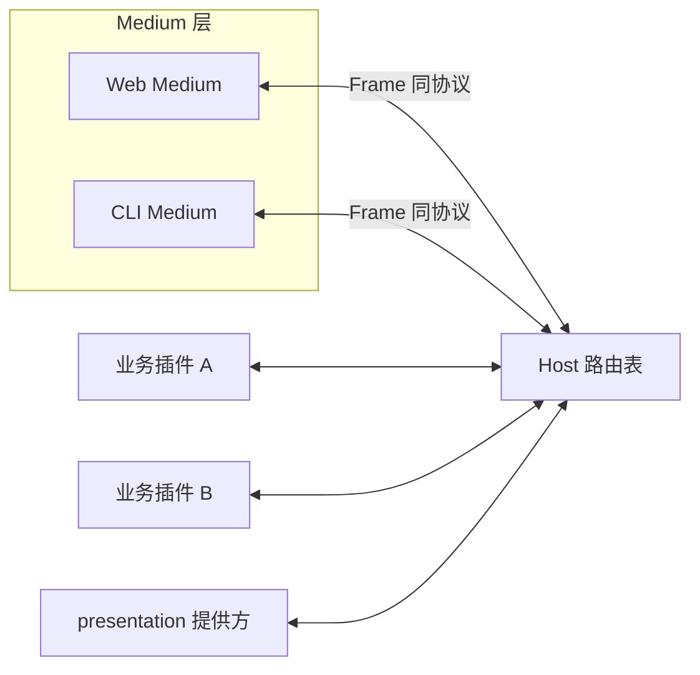

# Future — UI（Web / CLI）设计思路

**状态**：非规范、非 v1。不约束当前 [protocol.md](../protocol.md) 实现；v1 明确不做 UI / HostFace。

**前提**（沿用现行协议）：

- 路由与 dispatch **只看 `(capability, method)`**，插件名仅供日志、依赖图、观测。
- 无 `to` 字段；Host 查路由表转发；payload 对 Host 不透明。
- 一切跨端通信经 Host 星型中转。

---

## 1. 原则

Web / CLI **不是**第二套路由，而是同一套 Frame 协议上的 **Medium（展示 / 输入端）**。

| 不做 | 要做 |
|------|------|
| Medium 按插件名点名业务 | Medium 只发/收 `capability.method` |
| Host 解释 UI / 业务 payload | Host 只路由、归因、日志 |
| Web/CLI 专有 HTTP 业务面 | 展示与交互都走 Frame 能力 |
| Host 内建某一家 UI 框架 | Medium 可插拔、可多端并存 |



Medium 连接方式：与插件相同的 stdio Frame，或等价本地通道（由 Host 会话层封装）。对 Host 而言 Medium 是「会展示的对端」，不是特权路由层。

---

## 2. 出站（展示）

插件（或独立 presentation 提供方）发出展示意图，Host 不解读，只按协议旁路/转发给订阅方。

建议能力面（名称可再定）：

| capability | method（示例） | 用途 |
|------------|----------------|------|
| `presentation` | `render` | 主内容（markdown / 消息 / 摘要） |
| `presentation` | `card` | 结构化卡片（审批、表单回显等） |
| `presentation` | `stream` | 流式片段（token / 进度） |
| `presentation` | `status` | 状态条（idle / running…） |
| `presentation` | `panel` | 槽位面板增删改（Web） |

- 短生命周期、挂在某次 `Call` 上的中间态 → 优先 **归因 evt**（带 req `id`）。
- 与某次调用无关的全局推送 → 广播 evt（需先实现 Host 扇出/订阅，见 §5）。
- 载荷形状集中在 `presentation.*` 契约里，**不要**为每个业务插件发明一套 UI 字段。

Web 与 CLI 对同一 `presentation.*` 做各自降级：例如 `panel` 在 CLI 忽略或打日志，`render` 的 markdown 在 CLI 转 ANSI。

---

## 3. 入站（交互）

用户操作统一变成普通 **Call**，与插件互调同一条路径：

```text
Medium ──Call(capability, method, payload)──▶ Host ──▶ 属主插件
```

| 输入 | 落地 |
|------|------|
| 按钮 / 表单 / UI Action | `Call(某业务 capability, method, …)` |
| CLI `/xxx yyy` | 命令糖 → 同样解析成 `Call` |
| 审批 allow/deny | `Call(对应 choice/policy capability, …)` |

约束：

- **禁止** Medium 用插件名做业务寻址；若必须「只找某个插件」，应改成它独有的 capability，而不是加回 `to`。
- Medium 发出的 Call 仍由 Host 注入 `from`（如 `web` / `cli`），**溯源用，不路由**。
- CLI 原生命令（help / 退出等）留在 Medium 内；业务命令一律进能力表。
- 输入错误码与插件侧一致（`method_not_found`、`bad_arguments`…），便于统一处理。

---

## 4. 静态资源与清单（`manifest.ui`）

`ui` 字段只服务 **Web Medium 托管与拼版**，不参与 Frame 路由：

| 字段 | 含义 |
|------|------|
| `entry` | UI 入口（如 `main.js`） |
| `assets` | css / html 等静态资源 |
| `mounts` | 挂到某 page/slot 的组件标签 + 初始 property |
| `pages` | 页面 / 槽位贡献（可选） |

约定：

- 组件标签建议 `<插件名>-*` 前缀，**仅**便于调试与样式隔离，不是路由键。
- 初始 `property` 是静态配置；运行时变更走 `Call` / `presentation.*`，不在 HTTP GET/POST 上开业务旁路。
- CLI 无静态面，忽略 `ui` 即可。

---

## 5. Medium 如何挂上 Host（后续实现选项）

| 选项 | 做法 | 取舍 |
|------|------|------|
| **A. Medium = 特殊对端** | Host 识别「已注册的 Medium 会话」，把展示类 evt/res 复制给它们 | 简单；订阅模型在 Host 稍变厚 |
| **B. Medium = 普通插件** | Web/CLI 各自 `Register`/`Call`，订阅用未来 `presentation.subscribe` | 「一切皆插件」最纯；多进程与静态托管要自己扛 |
| **C. 混合** | 控制面走插件，静态文件由 Host 静态服务 | 落地快；边界要写死以免长出领域 HTTP 面 |

倾向：**短中期 A，长期可迁 B**。无论哪种，Host **不得**解析业务/展示 payload，也不得按插件名转发展示。

依赖的协议增强（均非 v1）：

1. 广播 evt 的**订阅表**（谁收 `presentation.*`）。
2. 归因 evt 的**消费 API**（调用方 SDK 读出旁路流）。
3. 可选：`Call` 带 ctx / 取消（UI 常要打断流式）。

---

## 6. 与 v1 边界对照

| v1（现行 protocol.md） | 本设计 |
|------------------------|--------|
| 非目标：一切 UI / HostFace | 扩展面，仍无按名路由 |
| 无 `to` | 继续无 `to` |
| evt 广播丢弃 | 升级为订阅扇出 |
| SDK 无 Emit / 旁路读取 | 增加 Emit / 归因流 |
| HostFace / config 面删除 | 若需设置页，做成普通 `config.*` 能力（可多提供方命名空间） |

---

## 7. 小结

UI = **同一协议上的 Medium**：出站 `presentation.*`，入站 `Call(capability, method)`，`manifest.ui` 只管静态拼版。Host 保持薄；Web/CLI 可替换、可并存。取舍是必须先定展示契约与订阅模型，不能靠 Host 特判「当前界面」。
