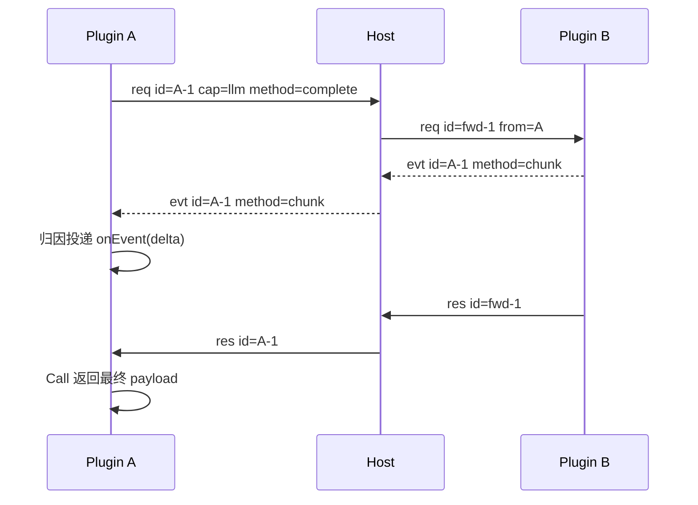

# pluginsdk — 插件开发者接口

本文说明 `pluginsdk` 包的**代码功能与用法**，供插件作者检阅。线协议与路由语义以 [protocol.md](protocol.md) 为准；名词以 [CONTEXT.md](../CONTEXT.md) 为准。

**原则**：插件**只 import `pluginsdk`**，不引用 Host / 内核包，也不手写 Frame 循环（测试夹具除外；夹具用 `protocol`）。插件只点名 `capability.method`，**不点名目标插件名**；目标由 Host 查路由表决定。

---

## 1. 总览

| 导出 API | 职责 |
|----------|------|
| `NewPlugin(name) *Plugin` | 创建进程内运行时（绑定 stdio） |
| `(*Plugin) Register(capability, method, handler)` | 登记本进程 handler |
| `(*Plugin) Call(capability, method, payload)` | 同步外呼（发送 + 等待） |
| `(*Plugin) Serve() error` | 上报 handlers 并进入接收循环 |
| `(*Plugin) Listen() error` | 接收循环（Serve 的主体） |
| `(*Plugin) Dispatch(frame)` | 处理一条入站 req 并写出 res |
| `ErrCode(code, msg) error` / `Code(err) string` | 带稳定错误码的 error |

内部（不导出）：`fail`（断连拆除 pending）、`complete`（完成出站 Call）、`writeFrame`（串行写 stdout）。

三条能力链：

```text
发送 Call ──写 req──► Host ──转发──► 对端 Dispatch
    ▲                                   │
    └────────── res（complete）◄── Host ◄┘

接收 Listen：stdin ──► req → Dispatch │ res → complete │ evt → 见 §8 Event
断连 fail：关闭全部 pending，阻塞中的 Call 返回 connection closed
```

Event 为旁路：不建立闭环、不进 `Register`。设计见 [§8](#8-event设计思路)。

---

## 2. 进程身份

```go
p := pluginsdk.NewPlugin("session")
```

- `name` 为**插件名**，进程创建时声明一次，应与目录名 / `plugin.json` 的 `name` 一致。
- 仅用于日志、依赖图、id 前缀（`session-1`）；**不参与路由**。
- Frame 的 `from` 由 **Host 注入**，插件不要也不应填写。

---

## 3. 注册（处理面的入口）

```go
type HandleFunc func(req *Request) (json.RawMessage, error)

type Request struct {
    ID         string          // 本次 req 的 id（与 res 闭环）
    Capability string
    Method     string
    Payload    json.RawMessage // 不透明业务载荷
}

p.Register("session", "query", func(req *pluginsdk.Request) (json.RawMessage, error) {
    // …业务逻辑…
    return resultJSON, nil
})
```

约定：

| 规则 | 行为 |
|------|------|
| 键 | `capability.method`（全局路由键的一半） |
| 同进程重复注册 | **last-wins**（覆盖旧 handler） |
| 跨进程属主冲突 | 本地不判；以 Host `register` 结果为准 |
| 未登记的入站 `req` | 自动回 `res`，`error_code=method_not_found` |
| `err == nil` | 成功，返回值作 `payload`，错误字段为空 |
| `err != nil` | 失败：`error_code=Code(err)`（空则 `handler_error`），`error_msg=err.Error()` |

指定细分错误码：

```go
return nil, pluginsdk.ErrCode("bad_arguments", "limit must be > 0")
// 调用方：if pluginsdk.Code(err) == "bad_arguments" { … }
```

`Code(err)` 对普通 `error` 返回 `""`；不在线格式中引入嵌套 error 对象。

---

## 4. 调用（发送）

```go
payload, err := p.Call("llm", "complete", reqJSON)
```

- **同步**：发 `req` 并阻塞至对应 `res`、断连（`fail`）或本地写失败。
- **只点名** `capability.method`，不点名插件；Host 查表转发到唯一属主（允许属主即自己，环回）。
- id 形如 `<plugin_name>-<seq>`，对端可见的转发 id 由 Host 改写（`fwd-N`），调用方无感。
- 成功：返回 `payload`，`error == nil`。
- 失败：`error` 可用 `Code(err)` 取错误码（Host 合成码或对端 handler 码）。

并发：多个 goroutine 可同时 `Call`；stdout 写入由 SDK 串行化。

---

## 5. 读循环（接收）

```go
func (p *Plugin) Serve() error
func (p *Plugin) Listen() error
```

### Serve

1. 后台 best-effort `Call("host", "register", {handlers:[…]})` 上报本进程键集合；
2. 进入 `Listen`，阻塞至 stdin 关闭。

典型 `main`：

```go
func main() {
    p := pluginsdk.NewPlugin("session")
    p.Register("session", "query", handleQuery)
    p.Register("session", "append", handleAppend)
    if err := p.Serve(); err != nil {
        log.Fatal(err)
    }
}
```

### Listen

| 入站 `type` | 行为 |
|-------------|------|
| `req` | `go Dispatch(frame)`（handler 可阻塞，不卡读循环） |
| `res` | `complete`：按 `id` 完成出站 `Call` 的 pending |
| `evt` | 旁路分流（归因 / 无归属），见 [§8](#8-event设计思路)。当前实现暂忽略，设计已定 |
| 其它 | 忽略（向前兼容） |

读失败或 stdin 关闭 → 先 `fail()`，再返回 error。

---

## 6. 断连（fail）

`fail()` 在接收循环结束时执行：

- 关闭并清空全部 `pending`；
- 所有阻塞中的 `Call` 收到空 res，返回 `connection closed`。

保证：**每个 `Call` 最终返回**（成功、错误或断连），不会永远挂死。v1 无调用超时（见 protocol §3.4）。

---

## 7. 处理（Dispatch）

```go
func (p *Plugin) Dispatch(frame *protocol.Frame)
```

对一条入站 `req` **恰好写出一条** `res`（同 `id`）：

| 情形 | res |
|------|-----|
| 无 handler | `error_code=method_not_found` |
| handler 返回错误且无 code | `error_code=handler_error`，`error_msg=err.Error()` |
| handler 返回 `ErrCode(c, m)` | `error_code=c`，`error_msg=m`（或 `err.Error()`） |
| handler 成功 | `payload=result`，错误字段为空 |

通常由 `Listen` 自动调用；导出以便测试直接驱动。`res` 的 `from` 同样由 Host 在回程注入。

---

## 8. Event（设计思路）

**状态**：设计已定；SDK 发出 / 消费 API 尚未落地（当前 `Listen` 对 `evt` 暂忽略）。线语义以 [protocol.md §2.3 / §3.6](protocol.md) 为准。

### 8.1 Event 是什么

> Event：`type=evt` 的 Frame，**无需应答的旁路消息**。

与 Request / Response 的差别：

| | Request | Response | Event |
|--|---------|----------|-------|
| 闭环 | 恰好对应一条 res | 恰好对应一条 req | **不建立**闭环 |
| 期望应答 | 是 | 是应答本身 | 否 |
| 键的含义 | `(capability, method)` 路由到属主 | 按 `id` 写回 caller | `capability.method` 是**主题**；`id` 是**归因** |
| 失败语义 | 合成 res + `error_code` | — | 正常路径错误字段为空；业务失败仍走 res |

两种细类（按 `id`）：

| 细类 | `id` | 语义 | Host v1 |
|------|------|------|---------|
| **归因** | 非空，指向在途 req | 「属于这一次 Call 的旁路」 | 挂到该 Call 的 pending，**不改写** `id` |
| **广播** | 空 | 无指定接收方的状态旁路 | **不扇出**，log 后丢弃 |

**归因 ≠ 寻址**。禁止用 `id` 或插件名选择业务目标；目标插件名（`to`）不存在。

### 8.2 为何叫 `Emit`（而不是 Send / Notify / Publish）

| 候选 | 为何不用 |
|------|----------|
| `Send` | 隐含「发给某人」，且易与 `Call` 混淆 |
| `Notify` | 与 Event 禁用同义词 *notification* 漂成两套词 |
| `Publish` | 暗示订阅总线与扇出；Host v1 并不做广播 |
| `Broadcast` | 同上，且为 Event 禁用同义词 |

**`Emit`** 表示「抛出一条不要求应答的消息」，与 `Call`（同步 req/res）构成一对：

> **`Call` 问并等；`Emit` 说但不等。**

`EmitByID` 而不是 `EmitTo`：`to` 已废（目标插件名寻址）；这里的 `id` 只做**归因**。

### 8.3 何时触发（发出侧）

| 场景 | 细类 | 发法 | 调用方为何要 |
|------|------|------|--------------|
| 流式生成 / 长计算吐中间结果 | 归因 | `EmitByID(req.ID, …)` | 边收边渲染，不等整段 res |
| 长任务进度 | 归因 | `EmitByID(req.ID, cap, "progress", …)` | 进度条 / 反馈 |
| 一次 Call 内多阶段步骤 | 归因 | `EmitByID(req.ID, cap, "step", …)` | 看到「第 N 步」 |
| 状态变更（就绪、降级、配置重载） | 广播 | `Emit(cap, "status", …)` | 观测 / 联动 |
| 旁路事实（后台任务完成） | 广播 | `Emit(cap, "changed", …)` | 松耦合通知 |

触发时机归三类：

1. **Handler 执行中**（有 `Request.ID`）→ 归因，`EmitByID(req.ID, …)`。  
2. **Handler 外异步体**（定时器、子流程）→ 通常广播，`Emit(…)`。  
3. **生命周期 / 横切状态** → 广播。

**应用 Event 的反例**：需要对端给出结果才能继续 → 用 `Call`；需要对端认领动作 → 用 `Call`。Event 发完即返回，没有业务重试闭环。

### 8.4 收到后如何处理（消费侧）

入站 `evt` **不进 `Register` 的 handler，不写 `res`**。`Listen` 只做分流：

```text
收到 evt
  ├─ id 非空 且命中 pending[id]  → 归因：投给该次 Call 的旁路通道
  ├─ id 非空 但无 pending       → 无归属
  └─ id 空                      → 广播
        └─ 无归属 / 广播 → OnEvent 钩子；未注册则丢弃（可 log）
```



处理约定：

1. **evt 无应答** — 禁止 `Dispatch` / 写 `res`；返回值无意义。  
2. **不与 `Register` 混用** — `Register` 只接 `req`；evt 另走旁路出口。  
3. **归因只投给发起方** — 未匹配 `pending` 的归因 evt 不转投别人、不改写 `id`。  
4. **Handler 内推流式** — 用入站 `Request.ID` + `EmitByID`；不要在 handler 里再 `Call` 回调用方。  
5. **错误仍走 res** — 业务失败不用 evt 表达。

### 8.5 消费形态（不必全是回调）

| 形态 | 适合 | 优点 | 代价 |
|------|------|------|------|
| **回调** `onEvent(*Event)` / `OnEvent(h)` | 流式 delta、进度 | 实时 | 注意并发与阻塞 |
| **channel 订阅** `Events() <-chan Event` | 汇入插件主循环 / `select` | 背压可控 | 要定缓冲 / 丢弃策略 |
| **结束后一并返回** `(result, []Event)` | 审计、回放 | API 简单 | **无实时性** |
| **内部累积不暴露** | 只要闭环 | 实现最小 | 调用方看不到过程 |

**主形态建议**（实现时应收成一种主入口 + 可选，避免三套并存）：

- 归因：**实时回调**（`CallWith(..., onEvent)`）为主；需要汇总再可选累积列表。  
- 无归属 / 广播：**`OnEvent` 回调**为主；若要汇入 `select` 再提供 channel。

### 8.6 拟定 API（待实现）

```go
type Event struct {
    ID         string          // 归因 id；广播为空
    Capability string          // 主题
    Method     string
    Payload    json.RawMessage
}

// 发出
Emit(capability, method string, payload json.RawMessage) error
EmitByID(id, capability, method string, payload json.RawMessage) error

// 消费
CallWith(capability, method string, payload json.RawMessage, onEvent func(*Event)) (json.RawMessage, error)
OnEvent(func(*Event))   // 可选；无归属 / 广播
```

`Call` 保持无回调签名；无 `onEvent` 时归因 evt 可只累积或丢弃（保证不打断 res 闭环）。

---

## 9. 与 Frame 的关系

线类型 `Frame` / `ReadFrame` / `WriteFrame` 的**唯一定义在 `protocol` 包**（Host 与 SDK 共用）。插件作者**只 import `pluginsdk`**，正常写 Handler / Call / Emit 即可，不接触 Frame。

对插件作者（夹具需要手写帧时才看 `protocol`）：

- **可见语义**：`id` / `type` / `capability` / `method` / `payload` / `error_code` / `error_msg`；
- **不要设置** `from`（Host 投递时注入）；
- **没有** `to` 字段（路由只看 capability+method）；
- `error_code` / `error_msg` 线上**始终出现**，成功时为空串。

`Request` 已拆好上述字段；handler 只面对 `Payload` 与错误约定即可。线编码：4 字节大端长度 + JSON body，上限 16 MiB。

---

## 10. 错误码速查（handler / Call 常见）

| code | 含义 |
|------|------|
| `method_not_found` | 无此 `(capability, method)` handler 或 Host 无此 method |
| `handler_error` | handler 返回无 code 的普通 error（默认） |
| `bad_payload` / `bad_arguments` | 载荷 / 参数问题（建议用 `ErrCode`） |
| `route_failed` / `plugin_not_mounted` / `plugin_down` | Host 路由或属主进程问题（Call 收到） |
| `server_closed` | 服务结束导致 pending 失败（预留） |

SDK 自带常量：`CodeMethodNotFound` / `CodeHandlerError` / `CodeBadPayload` / `CodeBadArguments` / `CodeServerClosed`。完整表见 [protocol.md §7](protocol.md)。业务码可自定义；Host 不解释，只透传。

---

## 11. v1 非目标

- 无 ctx / 取消 / 调用超时（预留 protocol §4.5 升级，不改 Frame 字段名）。
- Event **设计见 §8**；`Emit` / 消费 API **尚未实现**（当前 `Listen` 忽略 `evt`）。不用 `EmitTo` / `CallTo` 按插件名寻址。
- 无按插件名的业务路由（设计理念禁止目标插件名进入寻址）。
- UI / hostFace 不在本包范围。
- 广播扇出依赖 Host；Host v1 不做订阅分发（protocol §2.3）。
